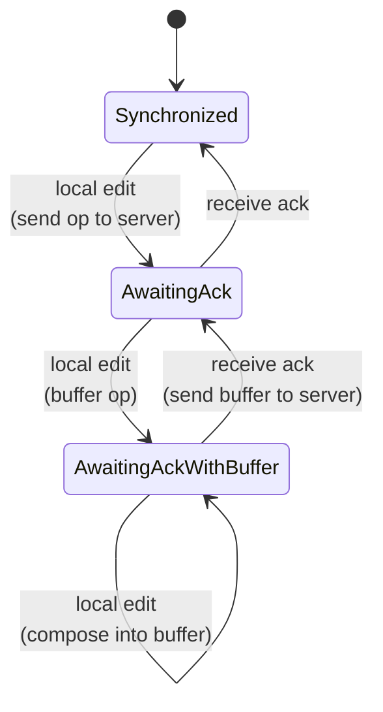

# Frontend OT Client

The frontend (`static/js/main.js`) implements the same OT algorithms as the Go backend, plus a state machine for managing in-flight operations.

## State machine

The client uses a 3-state machine to handle the asynchronous nature of WebSocket communication:

### Synchronized

No operations in flight. Local edits are sent immediately to the server.

### AwaitingAck

One operation has been sent to the server and we're waiting for acknowledgment. New local edits are stored in a buffer.

### AwaitingAckWithBuffer

An operation is in flight **and** the user has made additional edits. New local edits are merged into the existing buffer using `compose()`.

When the ack arrives, the buffer becomes the new in-flight operation and is sent to the server.

## Handling remote operations

When a remote operation arrives from the server, it must be transformed against any local pending/buffered operations:

| State | Action |
|-------|--------|
| **Synchronized** | Apply remote op directly |
| **AwaitingAck** | Transform pending against remote op, apply the transformed remote op |
| **AwaitingAckWithBuffer** | Transform pending, then buffer, then apply the doubly-transformed remote op |

## Compose

`compose(a, b)` merges two sequential operations into one. If a user types `"he"` then `"llo"`, compose combines them into a single operation that inserts `"hello"`. This keeps the buffer as a single operation rather than a growing list.

The algorithm walks both operations simultaneously:

- `a` deletes consume `a`'s input directly (pass through)
- `b` inserts produce output directly (pass through)
- Overlapping retain/delete/insert pairs are combined by taking the minimum length chunk

## CodeMirror integration

### Local edits (`makeOp`)

When CodeMirror fires a `change` event, `makeOp` converts it to an OT operation:

1. Calculate `from` position (index in document)
2. Build components: `Retain(from)` + `Delete(removedLen)` + `Insert(insertedText)` + `Retain(remaining)`

### Remote edits (`applyRemoteOp`)

Remote operations are applied to CodeMirror with change suppression to avoid re-sending:

1. Set `suppressChange = true`
2. Apply the operation to get the new document string
3. Transform the cursor position through the operation (`transformIndex`)
4. Set the new value and restore the cursor
5. Set `suppressChange = false`

### Cursor preservation (`transformIndex`)

`transformIndex` walks through an operation's components and adjusts a cursor position:

- **Retain**: no effect (just advance)
- **Insert before cursor**: shift cursor right by insert length
- **Delete before cursor**: shift cursor left by delete length (clamped to 0)

## Connection management

- Connects to `ws://host/ws` (or `wss://` for HTTPS)
- On open: sends `join` with the document ID
- On close: auto-reconnects after 2 seconds
- Document identity is the URL hash (`#abc123`) — same URL = same document
- Hash changes trigger disconnect + reconnect to the new document
