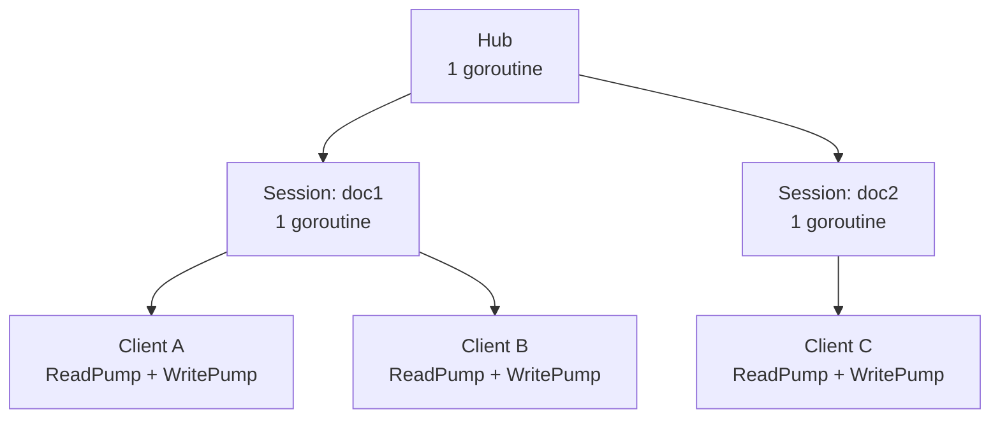

# Goroutine Model

The server uses a hierarchy of goroutines with channel-based communication. No mutexes are needed on document state.

## Goroutine hierarchy



## Hub

The `Hub` routes clients to document sessions. It runs a single goroutine that reads from the `joinDoc` channel:

```go
func (h *Hub) Run() {
    for req := range h.joinDoc {
        h.handleJoinDoc(req)
    }
}
```

When a join request arrives, the Hub either retrieves the existing session or creates a new one:

1. Check the session map (protected by `sync.RWMutex`)
2. If not found: create the document in the store, load it, create a new `Session`, start it with `go s.Run()`
3. Send the client to the session's `join` channel

The `sync.RWMutex` on `Hub` only protects the **session map**, not document state.

## Session

Each document gets its own `Session` running in a single goroutine. This is the core serialization design — all OT transforms, document mutations, and broadcasts happen sequentially:

```go
func (s *Session) Run() {
    for {
        select {
        case c := <-s.join:
            s.handleJoin(c)
        case c := <-s.leave:
            s.handleLeave(c)
        case om := <-s.incoming:
            s.handleOp(om)
        case <-s.stop:
            return
        }
    }
}
```

### Channels

| Channel | Buffer | Purpose |
|---------|--------|---------|
| `join` | 16 | Client join requests |
| `leave` | 16 | Client departures |
| `incoming` | 64 | Operations from clients |
| `stop` | 0 | Shutdown signal |

### Operation handling

When a client sends an operation:

1. **Transform** — `engine.TransformIncoming(op, revision, history)` transforms the operation against server history since the client's last known revision
2. **Apply** — `doc.Apply(transformed)` updates the document content and increments the version
3. **Persist** — `store.UpdateContent()` and `store.AppendOperation()` save the state
4. **Ack** — send `ack` with new revision to the sender
5. **Broadcast** — send the transformed `op` to all other clients in the session

## Client

Each WebSocket connection is a `Client` with two goroutines:

### ReadPump

Reads JSON messages from the WebSocket and dispatches them:

- `join` messages go to `hub.joinDoc`
- `op` messages go to `session.incoming`
- Unknown types get an error response

Connection settings:

| Setting | Value |
|---------|-------|
| `maxMsgSize` | 64 KB |
| `pongWait` | 60 seconds |

### WritePump

Drains the `send` channel (buffered to 256 messages) and writes to the WebSocket. Also sends periodic pings:

| Setting | Value |
|---------|-------|
| `writeWait` | 10 seconds |
| `pingPeriod` | 54 seconds (90% of pongWait) |

If the `send` channel is full when a message arrives, the message is dropped (slow client protection).
