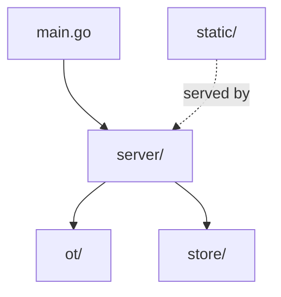
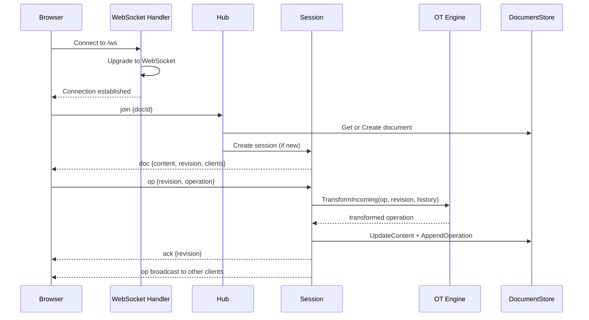

# Architecture Overview

## Package dependency graph

- **`ot/`** — Pure algorithm library with zero dependencies on other packages. Contains the operation model, transform function, and engine interface.
- **`server/`** — HTTP handler, WebSocket hub, per-document sessions, and client connection management. Depends on `ot/` and `store/`.
- **`store/`** — Document persistence abstraction. `MemoryStore` is the current implementation; the interface is designed for a future `FirestoreStore` drop-in.
- **`static/`** — Vanilla JS frontend with CodeMirror 5. Implements the same OT transform algorithm as the Go backend.

## Data flow

## Key design decisions

**Single-goroutine-per-session**: Each document session runs in exactly one goroutine. All OT transforms, document mutations, and client broadcasts happen sequentially in that goroutine via channel receives. This eliminates the need for mutexes on document state and makes the concurrency model simple to reason about.

**Retain/insert/delete model**: Operations are sequences of components that walk the entire document left-to-right, rather than position-based point mutations. This makes transform and compose operations well-defined and composable.

**Interface-driven extensibility**: `ot.Engine` and `store.DocumentStore` are interfaces. New OT algorithms (Wave, CRDT adapters) or storage backends (Firestore, PostgreSQL) can be swapped in without changing server code.
