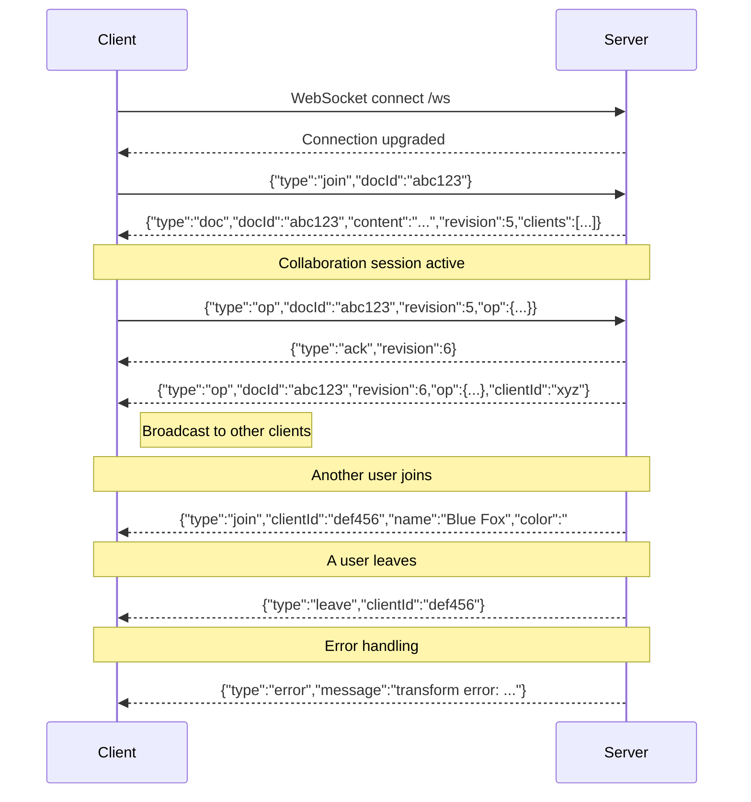

# WebSocket Protocol

All real-time communication uses a single WebSocket endpoint with JSON messages.

## Endpoint

```
ws://host/ws      (plain)
wss://host/ws     (TLS)
```

The server accepts any origin (`CheckOrigin` always returns `true`).

## Connection lifecycle



## Flow

1. **Connect** — client opens a WebSocket connection to `/ws`
2. **Join** — client sends a `join` message with the target `docId`
3. **Receive state** — server responds with a `doc` message containing the full document content, current revision, and list of connected clients
4. **Edit** — client sends `op` messages with their last known `revision` and the operation
5. **Ack** — server transforms the operation against any concurrent changes, applies it, and sends an `ack` with the new revision
6. **Broadcast** — server sends the transformed operation to all other clients in the session
7. **Presence** — `join` and `leave` messages are broadcast when users connect/disconnect

## Error handling

The server sends `error` messages in these cases:

- **Invalid message format** — JSON parse failure
- **Not joined** — client sends an `op` before joining a document
- **Unknown message type** — unrecognized `type` field
- **Transform error** — OT transform fails (e.g. base length mismatch)
- **Apply error** — operation cannot be applied to current document state

## Connection parameters

| Parameter | Value |
|-----------|-------|
| Max message size | 64 KB |
| Ping interval | 54 seconds |
| Pong timeout | 60 seconds |
| Write timeout | 10 seconds |

The server sends WebSocket pings every 54 seconds. If the client doesn't respond with a pong within 60 seconds, the connection is closed.
